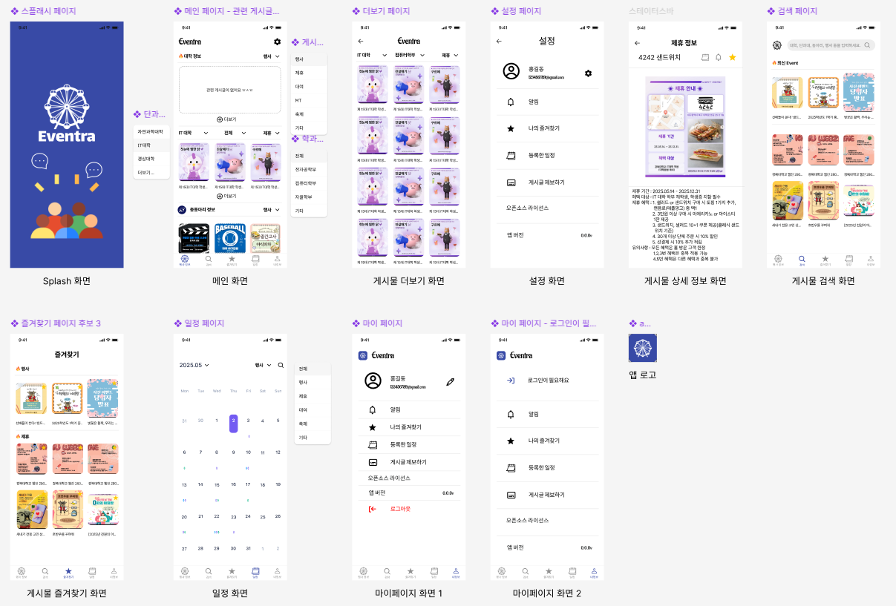
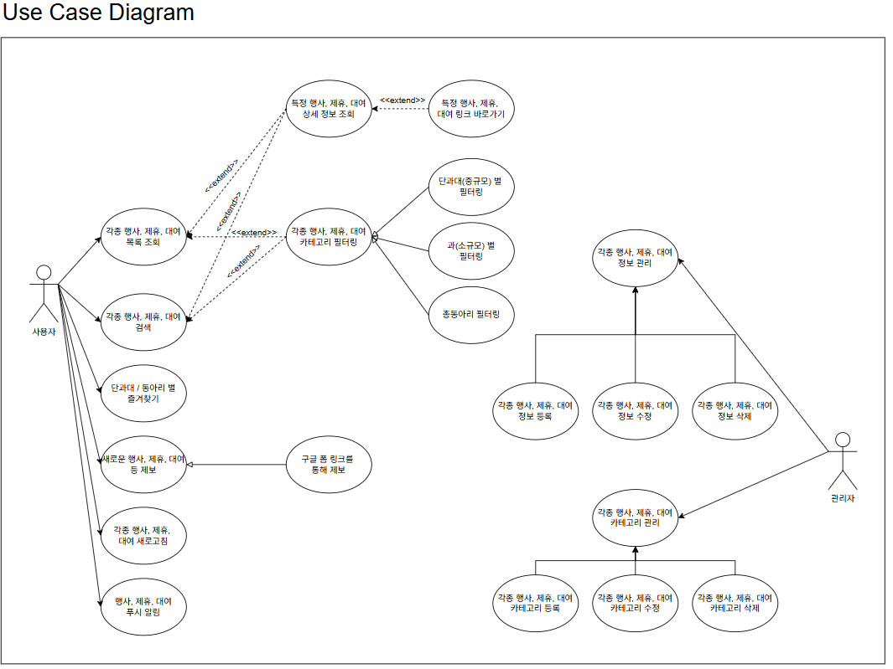
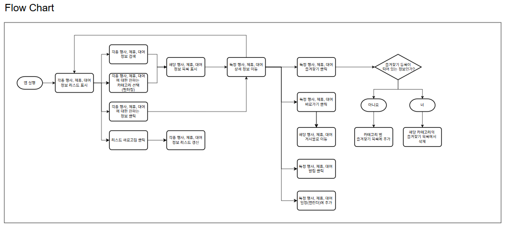
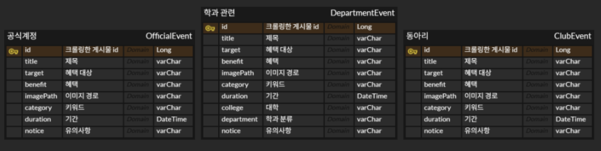

# 🤪 팀명 : "**해줘**"

# 프로젝트명 : "**Eventra**"

# 📜 팀 주제 : 경북대학교 단과대별 행사, 제휴, 대여 사업 안내 앱

# 🎆 서비스 소개 및 주제 선정 배경
대부분 학교 내 행사의 경우, 카카오톡, 인스타그램 등을 통해 행사, 제휴, 대여 사업 등을 안내합니다. 인스타그램의 경우, 사용자가 카테고리를 따로 생성하여 게시글을 저장하는 기능이 있지만, 사용자가 일일이 찾아서 저장해야 하는 번거로움이 있었습니다. 또, 사용자가 소속된 단과대 외에도 경북대 공식 계정에 올라오는 오프라인, 온라인 행사와 혜택, 총동아리에서 진행하는 행사, 혜택 등을 모두 모아 학생들이 참고할 수 있는 서비스가 필요해 보였습니다. “Eventra” 서비스에서는 인스타그램에 올라오는 모든 게시글을 행사, 제휴, 대여, MT, 축제 등의 카테고리를 기준으로 크롤링 후에 분류하는 과정을 거쳐 사용자가 한눈에 알아볼 수 있는 앱 서비스를 제공합니다.

 # 🔎 “Eventra” Docs
 “Eventra” 서비스에서 제공하는 기능 목록.

### 1. [대학, 단과대 및 과, 총동아리별 행사 게시글 목록]()
* **기능 소개**
  > 대학에서 진행하는 행사, 제휴, 대여, MT, 축제 등의 게시물을 확인할 수 있습니다.      
  > 단과대 및 소규모 과별에서 진행하는 행사, 제휴, 대여, MT, 축제 등의 게시물을 확인할 수 있습니다.    
  > 총동아리별에서 진행하는 행사, 제휴, 대여, MT, 축제 등의 게시물을 확인할 수 있습니다

### 2. [최신 게시글 목록]()
* **기능 소개**
  > 검색 페이지에서 최근에 올라온 따끈따끈한 게시물을 확인할 수 있습니다.

### 3. [게시물 검색 기능]()
* **기능 소개**
  > 사용자가 원하는 게시물의 제목을 검색하여 일부 게시물을 조회할 수 있습니다.
  
### 4. [즐겨찾기 기능]()
* **기능 소개**
  > 사용자가 일부 게시물을 조회하여 즐겨찾기 버튼을 클릭할 수 있습니다.    
  > 즐겨찾기를 누른 게시물은 따로 즐겨찾기 페이지에 모아 볼 수 있습니다.    
  > 즐겨찾기를 누른 게시물은 일정 페이지에 시작 날짜 기준으로 추가 됩니다.

### 5. [일정 기능]()
* **기능 소개**
  > 일정 페이지의 캘린더에서 사용자가 즐겨찾기한 게시물의 일정을 확인할 수 있습니다.

### 6. [알림 기능]()
* **기능 소개**
  > 게시물의 상세 정보 페이지에서 해당 게시물에 대한 날짜 알림을 설정할 수 있습니다.

### 7. [마이페이지 기능]()
* **기능 소개**
  > “Eventra”에서는 사용자가 단순히 진행 중인 행사 게시물만 보여주기 위해 로그인 기능을 구현하지 않았습니다.
  > 알림 기능에 대한 설정을 할 수 있습니다.    
  > 사용자가 즐겨찾기한 게시물 목록으로 이동할 수 있습니다.    
  > 크롤링에 빠진 게시물이나 사용자가 알고 있으나 앱 서비스에 없는 게시물을 제보 기능을 통해 알릴 수 있습니다.     
  ❗ 그러나, 즐겨찾기 게시물을 관리하는 방향에서 로그인 / 회원가입 기능이 필요할 것 같아 추후에 구현할 예정입니다.     

# 🎨 앱 디자인

# 📝 요구사항 명세서

### E-R Diagram

### 

# 🧠 크롤링 로직

# 👥 Contributor👇
### Front-End

|Name|Github|Email|
|:---|:---|:---|
|오한별|[hbohhh](https://github.com/hbohhh)|develop31@naver.com|
|허진수|[HJTN](https://github.com/HJTN)|zintnm21@gmail.com|

### Back-End

|Name|Github|Email|
|:---|:---|:---|
|송우승|[songwooseung](https://github.com/songwooseung)|dntmd2061@knu.ac.kr|
|정세엽|[clcok](https://github.com/clcok)|einstein3028@knu.ac.kr|
